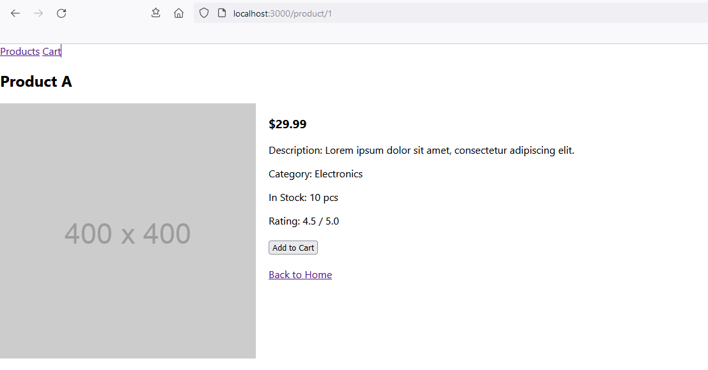

# Web Development Frameworks 2020 - Week Exercise 4

The goal of this exercise is to practice React Router.

In this exercise you are given a simple React application that displays a list of products, a detailed view of single product and a shopping cart view. Your task is to add routing to the application so that the user can navigate between the views.

You are given the basic react components and the data that is used in the application. You should not need to modify the existing components beyond adding routing to the application.

## Example images
Here is how the application should look like when finished.
> ProductsView rendering a list of the products and top menu offering router links to Products and Cart.
> 

> ProductDetailsView rendering information of a single product. Top menu same as previously. Back to Products (typo in image as Home) link offering route to get back to previous view.
> 

> CartView rendering static shopping cart content. Top menu same as previously.
> 

## Application Structure

In the application there are four react components:

- `App` is the root component that renders the navigation bar AND SHOULD IMPLEMENT THE ROUTING.
- `ProductsView` It renders the list of products. Each product is rendered using the `Product` component. It is the view that should be rendered when the user navigates to the root path `/`.
- `Product` is the component that renders a single product. It renders the product name and should render a router link to the single product view. It is used by the `ProductsView` component.
- `ProductDetailsView` is the component that renders a single product view. It renders the product details and should render a router link to the list of products. It is the view that should be rendered when the user navigates to the `/products/:id` path.
- `CartView` is the component that renders the shopping cart. It is the view that should be rendered when the user navigates to the `/cart` path. This compponent always renders the same content, there is no state data storing the shopping cart data.

## Application Product Data

The application uses the following data from the `products.js` file:

- `products` is an array of product objects. Each product object has the following properties:
  - `id` is the unique identifier of the product.
  - `name` is the name of the product.
  - `description` is the description of the product.
  - `price` is the price of the product.
  - `category` is the category of the product.
  - `stock` is the number of products in stock.
  - `rating` is the average rating of the product.

The products.js file also exports the following functions:

- `getProductById(id)` returns the product with the given id.
- `getAllProducts()` returns all products.

Those functions are used by the `ProductDetailsView` component to get the product data and by the `ProductsView`
component to get the list of products.

## Getting Started

1. Clone this repository to your computer.
2. Run `npm install` to install the dependencies.
3. Run `npm start` to start the development server.
4. Open [http://localhost:3000](http://localhost:3000) to view it in the browser.

## Tasks

### Task 1: Add routing to the application

Add routing to the application so that the user can navigate between the list of products, the single product view and the shopping cart.

Paths to implement:

- `/` should render the `ProductsView` component.
- `/products/:id` should render the `ProductDetailsView` component.
- `/cart` should render the `CartView` component.

Notice that the path to the single product view contains a dynamic segment `:id` that is used to identify the product. The `ProductDetailsView` component uses the `getProductById(id)` function to get the product data. You can read more about dynamic segments in the [React Router documentation](https://reactrouter.com/en/main/route/route#dynamic-segments). Notice especially the meaining of `:` caracter in the path and how to access the dynamic segment id value in the component with the useParams hook.

## Task 2: Add a link to the single product view

Add a link to the single product view from the list of products. The list of products is rendered by the `ProductsView` component. The `Product` component is used to render a single product. The `Product` component should render a link to the single product view. When user clicks the link, the single product view should be rendered.

## Task 3: Add a link to get back to the list of products from the product details view

Add a link to the list of products from the single product view. The single product view is rendered by the `ProductDetailsView` component. The `ProductDetailsView` component should render a link to the list of products. When user clicks the link, the list of products should be rendered (the `ProductsView` component and its route).

## Task 4: Add links to the top navigation bar

The top navigation bar should always be visible. It is rendered in the `App` component. Add links to the navigation bar so that the user can navigate between the list of products and the shopping cart.

## Available Scripts

In the project directory, you can run:

### `npm start`

Runs the app in the development mode.\
Open [http://localhost:3000](http://localhost:3000) to view it in your browser.

The page will reload when you make changes.\
You may also see any lint errors in the console.

### `npm test`

Launches the test runner in the interactive watch mode.\
See the section about [running tests](https://facebook.github.io/create-react-app/docs/running-tests) for more information.
